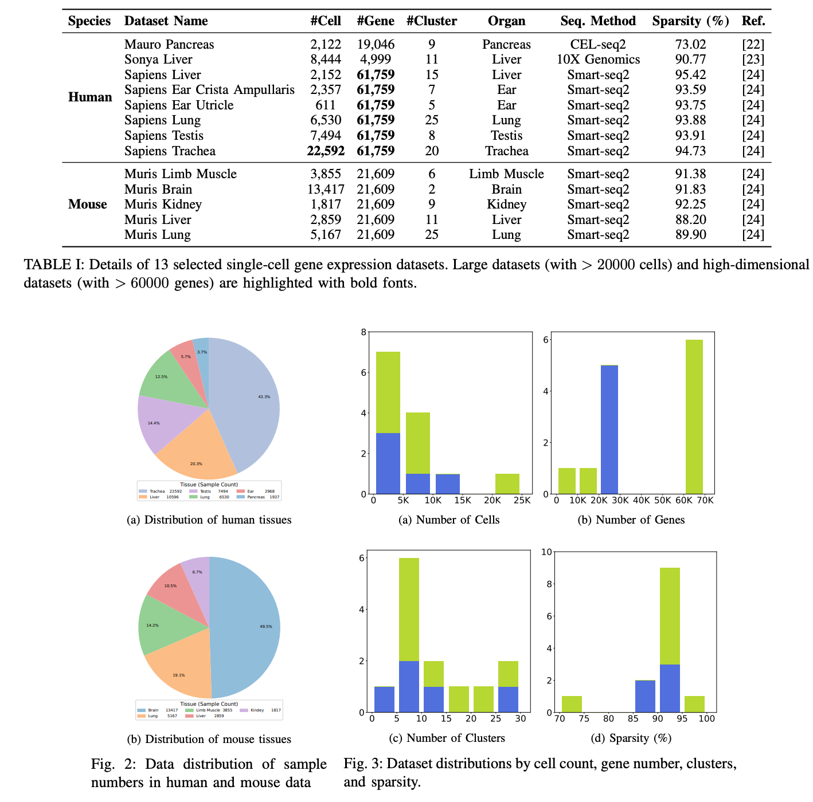
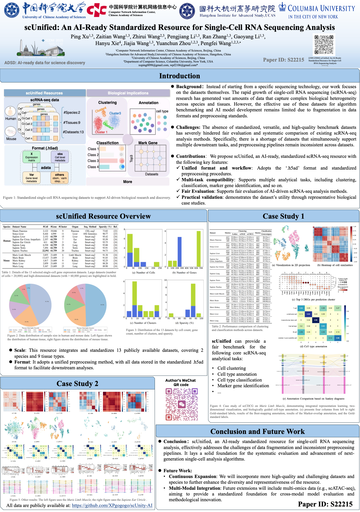

# scUnified: An AI-Ready Standardized Resource for Single-Cell RNA Sequencing Analysis

[Paper Link](https://arxiv.org/abs/2509.25884)

scUnified is a standardized, AI-ready resource designed to unify diverse single-cell RNA sequencing (scRNA-seq) datasets into a consistent, analysis-friendly format.  
It aims to facilitate fair benchmarking, support multiple downstream tasks, and accelerate the development of AI-driven scRNA-seq analytical methods.

---

## 📌 Background

The rapid expansion of single-cell RNA sequencing (scRNA-seq) research has produced a massive volume of heterogeneous datasets across species, tissues, and experimental settings.  
However, despite the abundance of data, their utility for benchmarking and AI model development remains limited due to the fragmentation in:

- data formats  
- preprocessing pipelines  
- annotation quality  
- compatibility with downstream tasks  

Existing resources tend to be technology-specific or task-specific, making it difficult to perform systematic evaluation across methods.

scUnified addresses these limitations by focusing directly on **datasets themselves**, rather than specific sequencing technologies.

---

## ⚠️ Challenges

The development and fair evaluation of scRNA-seq computational methods face several critical obstacles:

### • ❌ Lack of standardized benchmark datasets  
Current datasets vary greatly in file formats, preprocessing workflows, and annotation quality.

### • ❌ Limited support for multiple downstream tasks  
Few datasets can be used simultaneously for clustering, classification, trajectory inference, or marker gene analysis.

### • ❌ Difficulty ensuring fair comparison  
Inconsistent inputs lead to biased or incomparable results among existing clustering or deep-learning-based models.

These challenges outline the urgent need for a unified and AI-ready data resource.

---

## 🎉 Contributions

We propose **scUnified**, a comprehensive and standardized scRNA-seq resource designed for AI model development and reproducible benchmarking.  
Its main features include:

### ✔ Unified Format & Workflow  
- All datasets follow a consistent `.h5ad` format.  
- Standardized preprocessing and quality control pipelines are applied across species and tissues.  

### ✔ Multi-Task Compatibility  
Each dataset can be used for:  
- clustering  
- classification  
- marker gene detection  
- subtype annotation  
- and other downstream analyses  

### ✔ Fair Evaluation  
Standardized preprocessing ensures comparable input conditions for both traditional and AI-driven scRNA-seq analysis methods.

### ✔ Practical Validation  
We conduct representative case studies to demonstrate that scUnified enables meaningful biological insights and robust algorithm evaluation.

---

## 📚 Dataset Structure


All datasets will be continuously updated and expanded to include more species, tissues, and sequencing technologies.

---

## 📄 Figures

### 🧬 Chinese Introduction


### 🧬 English Introduction


---


## 🔗 Related Model Links

We provide several scRNA-seq clustering and representation learning models that are fully compatible with the scUnified dataset:

- **scCDCG** – https://github.com/XPgogogo/scCDCG

- **scSGC** – https://github.com/XPgogogo/scSGC

- **scSiameseClu** – https://github.com/XPgogogo/scSiameseClu

- **scMAE** – https://zenodo.org/records/10465991

- **GeneCompass** – https://github.com/xCompass-AI/geneCompas


## 📚 Citation

If you use scUnified (dataset or code) in your work, please cite:

```
@article{xu2025scunified,
  title={scUnified: An AI-Ready Standardized Resource for Single-Cell RNA Sequencing Analysis},
  author={Xu, Ping and Wang, Zaitian and Wang, Zhirui and Li, Pengjiang and Zhang, Ran and Li, Gaoyang and Xie, Hanyu and Wang, Jiajia and Zhou, Yuanchun and Wang, Pengfei},
  journal={arXiv preprint arXiv:2509.25884},
  year={2025}
}
```


# Contact
Ph.D student Ping XU

Computer Network Information Center, Chinese Academy of Sciences

University of Chinese Academy of Sciences

No.2 Dongshen South St

Beijing, P.R China, 100190

Personal Email: xuping0098@gmail.com

Official Email: xuping@cnic.cn


